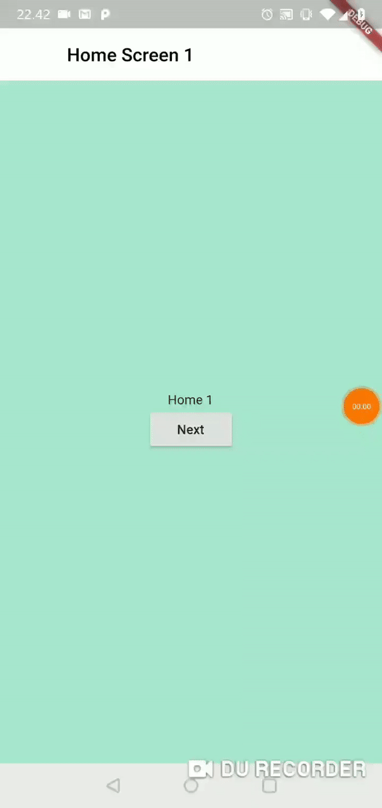

# Flutter Nested Navigation
<i>With persisten Navigation Bar and changing navigation title</i>

This project is a demonstration and example of nested navigation which mimics that of the android framework with activities and fragments.

## Preview

## Further Reading

A few resources if you want to read more:

- [Inheritedwidget](https://medium.com/flutter-community/widget-state-buildcontext-inheritedwidget-898d671b7956)

### [License: MIT](LICENSE.md)
